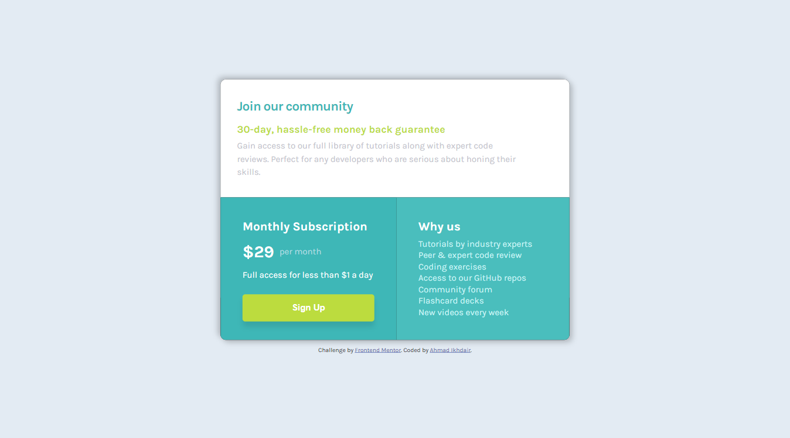

# Frontend Mentor - Single price grid component solution

This is a solution to the [Single price grid component challenge on Frontend Mentor](https://www.frontendmentor.io/challenges/single-price-grid-component-5ce41129d0ff452fec5abbbc). Frontend Mentor challenges help you improve your coding skills by building realistic projects. 

## Table of contents

- [Overview](#overview)
  - [The challenge](#the-challenge)
  - [Screenshot](#screenshot)
- [My process](#my-process)
  - [Built with](#built-with)
  - [What I learned](#what-i-learned)
  - [Continued development](#continued-development)
- [Author](#author)

**Note: Delete this note and update the table of contents based on what sections you keep.**

## Overview

### The challenge

Users should be able to:

- View the optimal layout for the component depending on their device's screen size
- See a hover state on desktop for the Sign Up call-to-action

### Screenshot

## My process

### Built with

- HTML5 
- CSS
- Flexbox
- CSS Grid

### What I learned

Used this as an opportunity to practice webpage responsiveness. Tried to make it as accurate to the design as possible with CSS.

### Continued development

Will continue working on getting better with responsiveness and the use of grids in CSS.

## Author

- Website - [Ahmad Ikhdair](https://github.com/AhmadIkhdair)
- Frontend Mentor - [@AhmadIkhdair](https://www.frontendmentor.io/profile/AhmadIkhdair)